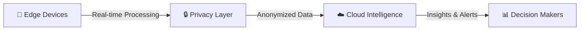

# ⚡ ARAGORN AI

### `AUTONOMOUS CONSTRUCTION INTELLIGENCE FOR INDIA`

```ascii
╔═══════════════════════════════════════════════════════════╗
║  EDGE-FIRST  ◆  PRIVACY-NATIVE  ◆  OFFLINE-CAPABLE  ║
╚═══════════════════════════════════════════════════════════╝
```

---

## 🎯 THE CRITICAL PROBLEM

| 👁️ BLIND EXECUTION | ⚠️ UNSAFE SITES | 💸 SYSTEMATIC LEAKAGE |
|:---:|:---:|:---:|
| No real-time progress visibility | Accidents, shutdowns, legal risk | Material theft, rework, delays |

> **Reality Check:** Most construction sites still rely on humans with clipboards walking around. That doesn't scale. Aragorn AI replaces guesswork with **continuous, automated intelligence**.

---

## 💡 OUR SOLUTION

### ON-SITE EDGE AI + CLOUD ANALYTICS



### Core Capabilities

- 📊 **AUTOMATED PROGRESS TRACKING** - Zone and floor-level monitoring
- 🦺 **REAL-TIME SAFETY ENFORCEMENT** - PPE & violation detection with instant alerts
- 📦 **MATERIAL VERIFICATION** - Delivery tracking and inventory validation
- ⏱️ **PREDICTIVE INTELLIGENCE** - Early warnings for delays and potential rework
- 🗣️ **MULTILINGUAL MOBILE REPORTING** - Hindi • English • Urdu

---

## 🚀 QUICK START

### Prerequisites
- Node.js 18+
- AWS Account
- Supabase Account

### Installation

```bash
# 1. Install dependencies
npm install

# 2. Configure environment
cp .env.local.example .env.local
# Edit .env.local with your AWS and Supabase credentials

# 3. Set up database
# Run supabase-schema.sql in your Supabase SQL Editor

# 4. Test AWS connection
npm run test:aws

# 5. Start development server
npm run dev
```

Visit `http://localhost:3000` and start analyzing construction sites!

📖 **Detailed Setup**: See [QUICK_START.md](QUICK_START.md)

---

## 🏗️ SYSTEM ARCHITECTURE

```
┌─────────────────────────────────────────────────────────────────┐
│                         EDGE LAYER                              │
│  ┌──────────────┐  ┌──────────────┐  ┌──────────────┐         │
│  │   📱 Mobile   │  │  📷 Cameras   │  │  🚁 Drones    │         │
│  │   Devices     │  │   On-Site     │  │   Aerial View │         │
│  └──────┬───────┘  └──────┬───────┘  └──────┬───────┘         │
│         │                  │                  │                  │
│         └──────────────────┼──────────────────┘                  │
│                            ↓                                     │
│         ┌──────────────────────────────────┐                    │
│         │  🧠 On-Device Computer Vision    │                    │
│         │  🔒 Local Anonymization          │                    │
│         │  💾 Offline Caching              │                    │
│         └──────────────┬───────────────────┘                    │
└────────────────────────┼────────────────────────────────────────┘
                         ↓
┌─────────────────────────────────────────────────────────────────┐
│                         CLOUD LAYER (AWS)                        │
│  ┌──────────────────────────────────────────────────────────┐  │
│  │  S3  │  Rekognition  │  Lambda  │  SageMaker  │  Bedrock │  │
│  └──────────────────────────────────────────────────────────┘  │
│         Data Aggregation • ML Training • LLM Analytics          │
└────────────────────────┬────────────────────────────────────────┘
                         ↓
┌─────────────────────────────────────────────────────────────────┐
│                      APPLICATION LAYER                           │
│  ┌─────────────────┐  ┌─────────────────┐  ┌─────────────────┐ │
│  │  💻 Web Dashboard │  │  📱 Mobile App   │  │  🔔 Alerts       │ │
│  │  For Managers    │  │  For Field Teams │  │  Audit Trails   │ │
│  └─────────────────┘  └─────────────────┘  └─────────────────┘ │
└─────────────────────────────────────────────────────────────────┘
```

---

## 🎨 DESIGN PRINCIPLES

### 🏎️ **EDGE-FIRST**
Critical decisions don't wait for the cloud

### 🔐 **PRIVACY BY DESIGN**
Face blurring and PII minimization on-device

### 🇮🇳 **INDIAN-FIRST**
Low bandwidth, low cost, multilingual

### 💰 **ROI-DRIVEN**
Every feature must reduce cost, risk, or time

---

## 🔧 TECHNOLOGY STACK

### Frontend
- Next.js 15 (React 19)
- TypeScript
- Tailwind CSS
- Framer Motion
- Recharts

### Backend
- Next.js API Routes
- Supabase (PostgreSQL)
- Real-time Subscriptions

### AWS Services
- **S3** - Image storage
- **Rekognition** - Computer vision AI
- **Lambda** - Serverless compute (planned)
- **SageMaker** - ML training (planned)

### Security
- Supabase Auth
- Row-Level Security (RLS)
- IAM Policies
- End-to-End Encryption

---

## 📊 CURRENT STATUS

| Milestone | Status |
|:----------|:------:|
| Problem Validation | ✅ Complete |
| Requirements & Design | ✅ Complete |
| MVP Development | ✅ Complete |
| AWS Integration | ✅ Complete |
| Single Site Pilot | ⏳ Ready |
| Multi-Site Scale | ⏳ Planned |

---

## 🚀 ROADMAP

### 🟢 PHASE 1 - Safety Foundation (COMPLETE)
- ✅ Safety detection
- ✅ Mobile reporting
- ✅ Helmet & PPE alerts
- ✅ AWS Rekognition integration

### 🔵 PHASE 2 - Execution Intelligence (IN PROGRESS)
- ⏳ Progress tracking from images
- ⏳ Material verification
- ⏳ Zone-level monitoring
- ⏳ Batch upload

### 🟣 PHASE 3 - Predictive Scale (PLANNED)
- ⏳ ML-powered analytics
- ⏳ Multi-site scaling
- ⏳ Custom models
- ⏳ Global expansion

---

## 👥 TARGET USERS

```
┌───────────────────┐   ┌───────────────────┐   ┌───────────────────┐
│   🏗️ Contractors   │   │  👷 Site Engineers │   │  🦺 Safety Officers │
│   SME Builders    │   │  Project Managers │   │  Compliance Teams │
└───────────────────┘   └───────────────────┘   └───────────────────┘
                │                       │                       │
                └───────────────────────┴───────────────────────┘
                                        │
                                ┌────────▼────────┐
                                │  📦 Store Managers │
                                │  Material Control │
                                └─────────────────┘
```

---

## 💰 PRICING (Estimated)

### AWS Costs
- **1,000 images/month**: ~$0.30
- **10,000 images/month**: ~$3
- **100,000 images/month**: ~$30

### Free Tier
AWS Free Tier includes 5,000 images/month for first 12 months!

---

## 📚 DOCUMENTATION

- [Quick Start Guide](QUICK_START.md) - Get started in 3 minutes
- [Implementation Guide](IMPLEMENTATION_GUIDE.md) - Complete technical documentation
- [AWS Setup Guide](AWS_SETUP_GUIDE.md) - Detailed AWS configuration
- [Database Schema](supabase-schema.sql) - Supabase table definitions

---

## 🧪 TESTING

```bash
# Test AWS connection
npm run test:aws

# Run development server
npm run dev

# Build for production
npm run build
```

---

## 🤝 CONTRIBUTING

We welcome contributions! Please see our contributing guidelines.

---

## 📣 ONE-LINE PITCH

**Aragorn AI gives construction teams real-time visibility and predictive control using privacy-first edge AI—built for India's reality.**

---

## 🌟 THE VISION

### **OPERATING SYSTEM FOR CONSTRUCTION EXECUTION**

> Starting with India. Expanding to emerging markets globally.

```
NOT dashboards.
NOT reports.
REAL intelligence, where the work happens.
```

---

**Built with ⚡ for the builders of tomorrow**

`Edge-First` • `Privacy-Native` • `India-Ready`

---

## 📄 LICENSE

MIT License - See LICENSE file for details

**⚡ ARAGORN AI - Autonomous Construction Intelligence**
